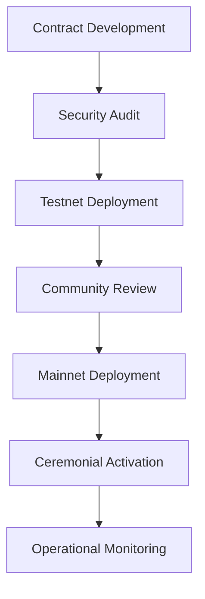

# EV0LVerse Unified Sovereign System Overview

**Protocol Version:** 1.0.0  
**Provenance Timestamp:** 2025-11-19T17:57:01Z  
**Author:** Bleu (4way4eva)  
**Classification:** Canonical Codex Artifact

---

## Executive Summary

The **EV0LVerse Unified Sovereign System** is a comprehensive multi-dimensional framework integrating blockchain technology, ceremonial protocols, economic mechanics, and governance structures into a cohesive metaverse architecture. This document serves as the canonical reference for understanding the interconnected systems that power EV0LVerse.

---

## I. Foundational Architecture

### 1.1 The Three-Domain Paradigm

EV0LVerse operates on a tripartite domain structure, each with distinct characteristics and purposes:

#### CIVILIAN Domain (Ω-CIV)
- **Allocation**: 47.6% of total system resources
- **Primary Functions**: 
  - Real estate tokenization and management
  - Educational infrastructure and curriculum
  - Commercial operations and trade
  - Public infrastructure development
- **Governance Model**: Democratic consensus with community voting
- **Economic Profile**: Stable, predictable yield generation
- **Key Assets**: Property NFTs, educational credentials, business licenses

#### MILITARY Domain (Ω-MIL)
- **Allocation**: 21.3% of total system resources
- **Primary Functions**:
  - Defense and security protocols
  - Tactical operations and strategic planning
  - Armament and equipment management
  - Security infrastructure
- **Governance Model**: Hierarchical command structure
- **Economic Profile**: Strategic reserves, controlled distribution
- **Key Assets**: Defense contracts, tactical equipment tokens, security clearances

#### COSMIC Domain (Ω-COS)
- **Allocation**: 31.1% of total system resources
- **Primary Functions**:
  - Portal logistics and dimensional travel
  - Quantum technology research
  - Cosmic artifact curation
  - Interdimensional commerce
- **Governance Model**: Research consensus and innovation councils
- **Economic Profile**: High-risk, high-reward, exponential potential
- **Key Assets**: Quantum patents, dimensional keys, cosmic artifacts

---

## II. Enhanced Non-Fungible Token (ENFT) System

### 2.1 ENFT Core Principles

ENFTs represent the next evolution of NFT technology, incorporating:

1. **Yield-Bearing Capability**: Each ENFT generates continuous yield
2. **Governance Rights**: Token holders participate in system governance
3. **Lineage Tracking**: Complete ancestral and provenance records
4. **Multi-Domain Spanning**: Single tokens can interact across domains
5. **Ceremonial Integration**: Ritual and attestation mechanisms built-in

### 2.2 ENFT Categories

#### Sovereign ENFTs
- **Tier**: APEX/PRIME
- **Rights**: Full governance, proposal, veto, execution
- **Yield**: Maximum rate ($28.9M/sec aggregate)
- **Inheritance**: Transferable with full lineage preservation

#### Treasury Nodes
- **Function**: Infrastructure and vault management
- **Type**: ERC-721 unique identifiers
- **Binding**: PayString + Ethereum vault association
- **Yield**: Based on vault performance and tier

#### Yield Certificates
- **Purpose**: Proof of yield generation
- **Type**: ERC-1155 semi-fungible
- **Transferability**: Freely tradeable
- **Redemption**: Convertible to liquid currency

#### Governance Emblems
- **Use**: Voting rights representation
- **Weight**: Tier-based voting power
- **Duration**: Perpetual or time-locked
- **Delegation**: Supports vote delegation

#### Ceremonial Artifacts
- **Nature**: Ritual and attestation tokens
- **Rarity**: Limited edition or unique
- **Purpose**: Commemorate events, ceremonies, milestones
- **Cultural**: High ceremonial significance

#### Lineage Scrolls
- **Function**: Inheritance and succession documentation
- **Storage**: IPFS-backed with on-chain hash
- **Verification**: Cryptographic proof of ancestry
- **Transfer**: Governed by succession protocols

---

## III. Treasury and Economic Mechanics

### 3.1 The π₄ Compounding Model

The system employs a unique compounding mechanism based on π₄ (pi-four), the fourth transcendental constant valued at **97.409**.

#### Compounding Formula

```
Final_Value = Initial_Value × (π₄)^(time_periods)

Where:
  π₄ = 97.409
  time_periods = elapsed_time / compounding_interval
```

#### Compounding Modes

1. **Aggressive Mode**: Full π₄ factor, maximum growth
2. **Continuous Mode**: Daily compounding at adjusted rate
3. **Tempered Mode**: Conservative scaling with risk mitigation

### 3.2 Yield Generation System

#### Total System Capacity
- **Per-Second**: $28,900,000 USD
- **Per-Day**: ~$2.5 trillion USD
- **Per-Year**: ~$911 trillion USD

#### Domain-Specific Allocation
```python
CIVILIAN_yield = total_yield × 0.476  # 47.6%
MILITARY_yield = total_yield × 0.213  # 21.3%
COSMIC_yield = total_yield × 0.311    # 31.1%
```

### 3.3 Currency Ecosystem

#### Primary Tokens
1. **$BLEU**: Sovereign governance token
   - Use: Voting, staking, governance proposals
   - Supply: Controlled emission via treasury
   - Backing: Treasury reserves + yield generation

2. **$YIELD**: Liquid yield representation
   - Use: Tradeable yield certificates
   - Generation: Minted from ENFT yield
   - Redemption: Convertible to base currencies

3. **$VAULT**: Treasury backing token
   - Use: Represents vault share ownership
   - Collateral: Backed by multi-chain vault holdings
   - Redemption: Partial vault withdrawal rights

#### Multi-Chain Support
- Ethereum (ETH)
- Polygon (MATIC)
- Avalanche (AVAX)
- Binance Smart Chain (BNB)
- Cronos (CRO)

---

## IV. Governance Framework

### 4.1 Governance Hierarchy

```
APEX AUTHORITY (Tier 0)
  ├── Full Rights: Proposal, Vote, Veto, Execute, Delegate
  │
  ├── PRIME AUTHORITY (Tier 1)
  │   ├── Rights: Proposal, Vote, Veto, Execute
  │
  ├── SOVEREIGN HOLDERS (Tier 2)
  │   ├── Rights: Proposal, Vote
  │
  ├── NOBLE HOLDERS (Tier 3)
  │   ├── Rights: Vote
  │
  └── CITIZEN HOLDERS (Tier 4)
      └── Rights: Vote
```

### 4.2 Proposal Types

1. **YIELD_ADJUSTMENT**: Modify yield parameters
2. **TIER_ELEVATION**: Promote nodes/holders
3. **VAULT_MIGRATION**: Treasury relocation
4. **EMERGENCY_PAUSE**: System-wide halt
5. **SCHEMA_UPDATE**: Protocol modifications
6. **CEREMONIAL_AMENDMENT**: Charter revisions
7. **CROSS_DOMAIN_TRANSFER**: Inter-domain asset movement
8. **LINEAGE_VALIDATION**: Ancestry verification updates

### 4.3 Voting Mechanics

- **Quorum**: 51% of tier-weighted voting power
- **Approval**: 66.67% supermajority
- **Voting Period**: 7 days (604,800 seconds)
- **Timelock**: 2-day execution delay post-approval
- **Emergency Override**: APEX veto within timelock period

---

## V. PayString Integration

### 5.1 PayString Protocol

PayString provides human-readable addresses for cryptocurrency transactions, replacing complex hexadecimal addresses.

**Format**: `{username}${domain}`  
**Example**: `4waybleu$paystring.crypto.com`

### 5.2 Vault Binding

Each PayString is cryptographically bound to one or more blockchain vaults:

```json
{
  "paystring": "4waybleu$paystring.crypto.com",
  "bindings": [
    {
      "network": "ethereum",
      "chain_id": 1,
      "address": "0x36CA5f34E5E873e7c3dF37432081d20b4Af320Be",
      "verified": true,
      "signature": "0x..."
    },
    {
      "network": "polygon",
      "chain_id": 137,
      "address": "0x...",
      "verified": true,
      "signature": "0x..."
    }
  ]
}
```

### 5.3 Resolution Process

1. Client queries PayString via HTTPS
2. Resolver returns vault addresses for requested network
3. Optional: Resolver provides schema IPFS CID
4. Client verifies cryptographic signatures
5. Transaction proceeds to verified vault

---

## VI. Smart Contract Architecture

### 6.1 Core Contracts

#### UniversalMintProtocol
- **Purpose**: Three-domain supply management
- **Features**: Watchtower consensus, yield tracking
- **Access**: Role-based with emergency controls

#### TripleStackTreasuryLedger
- **Purpose**: Sovereign ENFT system with yield representation
- **Capacity**: $28.9M/sec aggregate yield
- **Domains**: CIVILIAN, MILITARY, COSMIC tracking

#### BleuCrownMintUltraMax
- **Purpose**: Artifact minting controller
- **Features**: Automatic yield tracking, lineage management
- **Integration**: PayString binding support

#### zkPoRVerifier
- **Purpose**: Zero-knowledge proof of reserve verification
- **Use**: Privacy-preserving treasury audits
- **Technology**: zk-SNARKs/zk-STARKs

#### ENFTLedger
- **Purpose**: Enhanced NFT ledger system
- **Features**: Yield tracking, governance integration, lineage
- **Standards**: ERC-721, ERC-1155 compatible

### 6.2 Security Features

1. **Multi-Signature**: 3-of-5 requirement for critical operations
2. **Timelock**: 48-hour delay on governance execution
3. **Pausable**: Emergency pause capability via AccessControl
4. **Upgradeable**: Transparent proxy pattern
5. **Reentrancy Guards**: Protection on all external calls
6. **Access Control**: OpenZeppelin RBAC implementation
7. **ZK Verification**: Optional zero-knowledge requirements

---

## VII. Ceremonial Infrastructure

### 7.1 Ritual Framework

The EV0LVerse incorporates ceremonial protocols that blend cultural significance with technical functionality.

#### Core Rituals

1. **Treasury Activation Rite**: Deploying new treasury nodes
2. **Yield Harvest Ceremony**: Compounding and distribution events
3. **ENFT Consecration**: Minting of significant tokens
4. **Lineage Binding**: Connecting ancestral chains
5. **Emergency Pause Ritual**: Security response protocol
6. **Governance Assembly**: Proposal and voting ceremonies

### 7.2 Ceremonial Attestation

All major system events require ceremonial attestation:

```solidity
struct CeremonialAttestation {
    bytes32 eventId;
    uint256 timestamp;
    address[] witnesses;
    bytes32 ceremonialSeal;
    string ipfsProof;
}
```

### 7.3 Glyph System

Sacred glyphs represent system elements:

- **◈** APEX SEAL: Supreme authority
- **⧈** CASCADE FLOW: Yield generation
- **⟐** VAULT LOCK: Security
- **⊹** TRINITY NODE: Three-domain balance
- **⌬** TEMPORAL ANCHOR: Provenance
- **⟡** GENESIS SIGIL: Creation
- **⟢** LINEAGE THREAD: Inheritance
- **⟣** YIELD SPIRAL: Compounding

---

## VIII. Technical Implementation

### 8.1 Deployment Pipeline



### 8.2 Mirror Agent System

A background service monitors treasury vaults and mirrors events to the codex:

```javascript
// Pseudo-code
async function mirrorToCodex(event) {
    const record = {
        event_type: event.type,
        vault_address: event.address,
        value: event.value,
        timestamp: event.timestamp,
        signature: await sign(event)
    };
    
    await axios.post(CODEX_ENDPOINT, record);
}
```

### 8.3 IPFS Integration

All ceremonial documents and metadata are stored on IPFS:

- **Schemas**: Machine-readable definitions
- **Charters**: Ceremonial documents
- **Metadata**: ENFT attributes and images
- **Proofs**: Cryptographic attestations
- **Lineage**: Ancestry records

---

## IX. Interoperability and Standards

### 9.1 ERC Compliance

- **ERC-721**: Unique ENFT tokens
- **ERC-1155**: Semi-fungible yield certificates
- **ERC-20**: Liquid currency tokens ($BLEU, $YIELD, $VAULT)
- **ERC-2981**: NFT royalty standard
- **ERC-4626**: Tokenized vault standard

### 9.2 Cross-Chain Bridges

Support for asset transfer between:
- Ethereum ↔ Polygon
- Ethereum ↔ Avalanche
- Ethereum ↔ BSC
- Polygon ↔ Avalanche
- Multi-way routing via bridge aggregators

### 9.3 Oracle Integration

Price feeds and external data from:
- Chainlink for yield calculations
- Band Protocol for multi-chain data
- UMA for optimistic oracle queries

---

## X. Future Roadmap

### Phase 1: Foundation (Q4 2024 - Q1 2025)
- ✓ Core contract deployment
- ✓ PayString integration
- ✓ Basic ENFT minting

### Phase 2: Expansion (Q2 2025)
- Multi-chain vault deployment
- Advanced yield mechanics
- Governance system activation

### Phase 3: Maturation (Q3 2025)
- Cross-domain protocols
- ZK proof integration
- Ceremonial infrastructure

### Phase 4: Evolution (Q4 2025+)
- Layer 2 scaling solutions
- AI-enhanced governance
- Quantum-resistant cryptography

---

## XI. Conclusion

The EV0LVerse Unified Sovereign System represents a paradigm shift in blockchain-based metaverse infrastructure. By combining technical excellence with ceremonial integrity, economic innovation with cultural depth, and decentralized governance with hierarchical efficiency, it creates a framework for sustainable, meaningful digital sovereignty.

This system is designed not merely for speculation or entertainment, but as a foundation for genuine digital civilization—complete with economic structures, governance mechanisms, cultural practices, and technical infrastructure capable of supporting complex societies across multiple domains and dimensions.

---

**Document Hash**: `keccak256(this_document)`  
**IPFS CID**: `{TO_BE_PINNED}`  
**Canonical Status**: ✓ VERIFIED  
**Last Updated**: 2025-11-19T17:57:01Z

---

*End of Overview*
