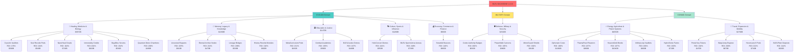

```mermaid
graph TD
    A[BLEU BACKBONE v1.0.0] --> B[CIVILIAN Domain]
    A --> C[MILITARY Domain]
    A --> D[COSMIC Domain]

    B --> S1["🧬 Healing, Medicine & Biology<br/>$3670B"]
    S1 --> P1_1["CryoLife Vaultlets<br/>ROI: 176%<br/>$580B"]
    S1 --> P1_2["Soul Recode Pods<br/>ROI: 184%<br/>$540B"]
    S1 --> P1_3["NanoHeal Clouds<br/>ROI: 184%<br/>$710B"]
    S1 --> P1_4["Immortality Credits<br/>ROI: 204%<br/>$820B"]
    S1 --> P1_5["SkyyBleu Serums<br/>ROI: 194%<br/>$530B"]
    S1 --> P1_6["Quantum Detox Chambers<br/>ROI: 206%<br/>$490B"]

    D --> S2["⚡ Energy, Agriculture & Planet Systems<br/>$4650B"]
    S2 --> P2_1["Ziphonate Cores<br/>ROI: 186%<br/>$1200B"]
    S2 --> P2_2["PlasmaPearl Reactors<br/>ROI: 187%<br/>$890B"]
    S2 --> P2_3["HeavenGold Bonds<br/>ROI: 167%<br/>$1040B"]
    S2 --> P2_4["InfinityLoop Vaultlets<br/>ROI: 186%<br/>$800B"]
    S2 --> P2_5["HydroDome Farms<br/>ROI: 200%<br/>$720B"]

    C --> S3["🛡️ Defense, Military & Security<br/>$2520B"]
    S3 --> P3_1["Codex Authority Badges<br/>ROI: 200%<br/>$630B"]
    S3 --> P3_2["PhaseWalk Cannons<br/>ROI: 165%<br/>$980B"]
    S3 --> P3_3["MirrorGuard Shields<br/>ROI: 194%<br/>$910B"]

    B --> S4["🧠 Memory, Legacy & Knowledge<br/>$2200B"]
    S4 --> P4_1["Ancestral Engrams<br/>ROI: 205%<br/>$610B"]
    S4 --> P4_2["Eternal Archive Nodes<br/>ROI: 213%<br/>$470B"]
    S4 --> P4_3["Lineage Bridges<br/>ROI: 206%<br/>$520B"]
    S4 --> P4_4["History Rewrite Modules<br/>ROI: 216%<br/>$600B"]

    D --> S5["🚀 Travel, Expansion & Mobility<br/>$2700B"]
    S5 --> P5_1["Portal Key Tokens<br/>ROI: 194%<br/>$470B"]
    S5 --> P5_2["WarpJump Engines<br/>ROI: 200%<br/>$870B"]
    S5 --> P5_3["HoverLane 8 Pods<br/>ROI: 222%<br/>$740B"]
    S5 --> P5_4["BLEUFleet Outposts<br/>ROI: 244%<br/>$620B"]

    B --> S6["🏛️ Education & Justice<br/>$1470B"]
    S6 --> P6_1["MetaCurriculum Pods<br/>ROI: 231%<br/>$430B"]
    S6 --> P6_2["Combat Academies<br/>ROI: 195%<br/>$560B"]
    S6 --> P6_3["BLEUJustice Domes<br/>ROI: 167%<br/>$480B"]

    B --> S7["🎭 Culture, Sports & Influence<br/>$1280B"]
    S7 --> P7_1["HoloConcert Domes<br/>ROI: 244%<br/>$550B"]
    S7 --> P7_2["BLEU SportsVerse Arenas<br/>ROI: 248%<br/>$730B"]

    B --> S8["💰 Economy, Commerce & Finance<br/>$960B"]
    S8 --> P8_1["SmartAd Beacons<br/>ROI: 146%<br/>$960B"]

    style A fill:#ff6b6b
    style B fill:#4ecdc4
    style C fill:#ffe66d
    style D fill:#a8e6cf
```
